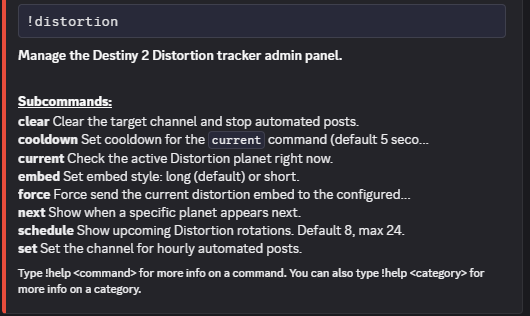
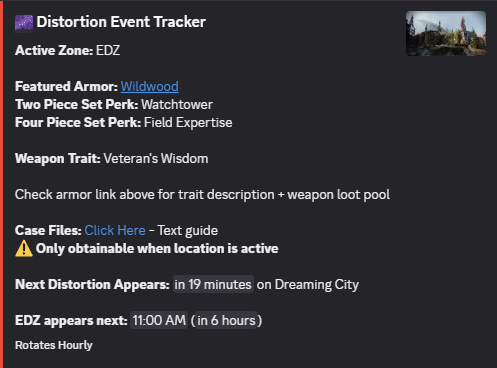
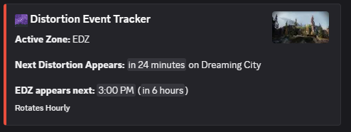
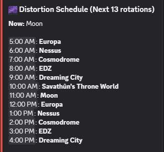

# Distortion Tracker for Red-DiscordBot

A clean, mobile-optimized Red-DiscordBot cog that tracks the hidden hourly Destiny 2 Distortion planet rotation. It uses native Discord dynamic timestamps to provide live countdown tracking without spamming API calls.

## Features

* **Automated Hourly Alerts** - Automatically posts the current rotation details to a configured channel at the top of every hour.
* **Smart Anti-Spam Filtering** - Built-in drift protection and internal deduplication locks ensure your channels never receive double posts when an hourly automatic post is generated.
* **Dynamic Timezones** - Uses native Discord relative time formatting (`<t:TIMESTAMP:R>`) so players see real-time countdowns tailored to their own local device clocks.
* **Multi-guild/server support**
* **Configurable Embed Style** - Choose `short` (current planet, next planet, and when the current planet returns) or `long` (everything shown in the sample embed below). Default is `long`.
* **User commands** - Available as a replacement for, or complement to, the automatic posts.

---

## Installation

### Prerequisites

This cog requires an active instance of Red-DiscordBot. If you don't have one set up yet, follow one of the guides below:

* **Standalone Installation:** [Red-DiscordBot Installation Guide](https://github.com/cog-creators/red-discordbot#installation)
* **Docker Deployment:** [PhasecoreX Docker Red-DiscordBot](https://github.com/PhasecoreX/docker-red-discordbot)

Red-DiscordBot needs the following permissions in any channel in which this cog will be used:

* `View Channel`
* `Send Messages`
* `Embed Links`

### Adding the Cog to Your Bot

Open your Discord client and run the following commands in a channel your bot can read:

1. **Add the repository:**
   ```text
   [p]repo add cogomatic https://github.com/kardain/cog-o-matic
   ```

2. **Install the cog package:**
   ```text
   [p]cog install cogomatic distortiontracker
   ```

3. **Load the cog:**
   ```text
   [p]load distortiontracker
   ```

---

## Commands Reference

The admin commands below require **Administrator** or **Manage Channels** permissions.

* **`[p]distortion`**
  Displays the help and module management menu.

* **`[p]distortion set [channel]`**
  Registers a target text channel for the automated hourly rotation alerts. If no channel is specified, defaults to the channel the command was run.  
  > Note: This cog has been running for a little over two weeks in a test server as of (date) while I picked at it in between my work schedule. It's rotation schedule has remained in sync with both in-game display and other third party community tools.  

* **`[p]distortion clear`**
  Deregisters the configured channel and stops automated posting.

* **`[p]distortion cooldown <int>`**
  Sets the cooldown for the `current` command, in seconds (default 5). `<int>` is optional. Accepted range is 1 through 60. Values above 60 are capped to 60, and values below 1 are floored to 1. While on cooldown, the bot will respond only with a self-clearing message notifying the `current` command is on cooldown.

* **`[p]distortion embed <short/long>`**
  Sets the embed style. `short` or `long` is required. Default is `long`.

* **`[p]distortion force`**
  Bypasses timers to immediately force-send the active distortion embed. Useful for manual testing or verifying layout.

The user commands below require **Send Messages** and **Embed Links** permissions in the channel used. They're intended to complement, or stand in for, the autoposts:

* **`[p]distortion current <long/short>`**
  Displays the current planet in rotation, in the channel where the command was invoked. Subject to the cooldown set via `[p]distortion cooldown` (default 5 seconds). `long` or `short` is optional. If omitted, `current` follows the style set by `embed`.

* **`[p]distortion schedule <int>`**
  Shows upcoming Distortion rotations in the channel where the command was invoked. `<int>` is optional and defaults to 8, with a max of 24. Values above 24 are capped to 24, with a note in the embed: *"24 rotation max, displaying next 24."* Values below 1 fall back to the default of 8.

* **`[p]distortion next <planet>`**
  Shows when a specific planet appears next. `<planet>` is required. Omitting it will trigger Discord's standard missing-argument error (the fancy way of saying it will display the help menu). If an unrecognized planet name is given instead, the bot replies with a list of valid options. Alias support covers all planet names, and is required (not just convenient) for `EDZ` and `Savathûn's Throne World`, whose casing and diacritics `next` can't reliably infer on its own:

  ```text
  {
    "ALIAS": "LOCATION",
    "moon": "Moon",
    "europa": "Europa",
    "nessus": "Nessus",
    "cosmodrome": "Cosmodrome",
    "edz": "EDZ",
    "dreaming": "Dreaming City",
    "dreaming city": "Dreaming City",
    "throne": "Savathûn's Throne World",
    "throne world": "Savathûn's Throne World",
    "savathun": "Savathûn's Throne World",
    "savathûn": "Savathûn's Throne World"
  }
  ```

---

## Recommended Usage

Most servers use this cog in one of two ways:

- **Set-and-forget**: Use `[p]distortion set [channel]` for automatic hourly posts.
- **On-demand only**: Don't set a channel, and let users use `current`, `next`, and `schedule` as needed.  
- But at the end of the day, you do you.   

## Previews

### Help Menu Panel  



### Active Distortion Embed (Long version)



### Active Distortion Embed (Short version)

  

### Distortion Schedule Embed  

  
